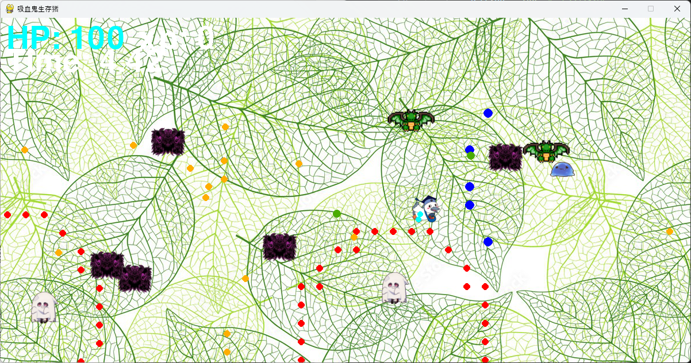

# 吸血鬼生存猪

## 実行環境の必要条件
* python >= 3.10
* pygame >= 2.1

## ゲームの概要
* 主人公キャラクターをマウスで操作し、敵からの攻撃を避けながら敵を殲滅するゲーム
* 参考URL：https://store.steampowered.com/app/1794680/Vampire_Survivors/?l=japanese

## ゲームの遊び方
* 次々と現れる敵を避けながら戦い、自分から放たれる弾を当てて敵を殲滅しよう！
* 弾は自動で発射されるので、敵の攻撃から避けながら逃げよう！
* 出てくる敵をすべて倒すとゲームクリア！
* 敵を1体倒す毎に経験値を獲得でき、レベルアップすることでHPを回復できるぞ！

## ゲームの実装
### 共通基本機能
* 背景画像と主人公キャラクターの描画
* プレイヤーのレベルアップ時に、強化するスキルを選択する画面表示

### 分担追加機能
* ステージ移動：移動方向とマウスの座標取得でキャラクターの移動
* 攻撃パターン：敵及び味方の弾発射方法を作成
* カウントダウン：ゲーム開始時にカウントダウンを用意
* レベルアップ：敵を倒した時に、HPを全回復

### ToDo
- [ ] もっと敵の動きをいじる
- [ ] 敵を再出現させるようにしたが、時間の制限的に厳しかった

### メモ
* すべてのクラスに関係する関数は，クラスの外で定義してある
* 敵の球数に対して、操作プレイヤーが攻略可能な設定にする必要あり